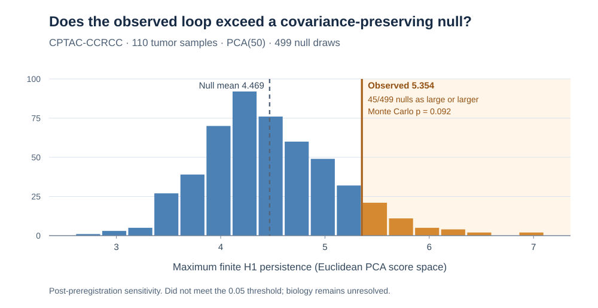

# Principal component analysis (PCA) and persistent homology (PH): cross-cohort replication

## What this is and what problem it solves

This is a research codebase for checking whether a change in the longest-lived one-dimensional homology (H1) feature after PCA reflects the data or also appears in generated controls. It contains a pilot analysis, cohort-specific replication scripts, a parameter sweep, confound checks, and independently recorded follow-up audits. The command-line entry point is `reproduce.py`; it is not a hosted service or a reusable inference library.

**Publication and citation:** The [July 2026 submission package](https://github.com/smaniches/pca-topology-crossdomain-replication/releases/tag/v0.1.0-biorxiv) is the historical GitHub release. The manuscript was **not posted** on bioRxiv following its organizational-affiliation screening decision (submission `BIORXIV/2026/737609`). The repository records Zenodo DOI [10.5281/zenodo.21287944](https://doi.org/10.5281/zenodo.21287944) for the original work; its live record, files and version relationship have **not been independently verified** here. The October corrections and experiments on GitHub must not be represented as already included in that archive. See [archive provenance and citation guidance](docs/ARCHIVAL_PROVENANCE.md).

**Latest executed sensitivity:** In 110 kidney-cancer tumor samples, the maximum first-homology persistence was **5.354** versus a mean of **4.469** across 499 covariance-preserving controls. **45 controls equaled or exceeded the observation (one-sided p = 0.092)**, so this analysis did **not** meet its prespecified 0.05 threshold. This neither proves nor disproves biological topology. [Read the experiment explained](docs/EXPERIMENT_EXPLAINED.md), including why an earlier 194-sample test reported p = 0.002 without being directly comparable.



## Why existing approaches fall short

Comparing the observed H1 persistence before and after PCA alone cannot distinguish a data-specific change from one induced by the projection. The scripts therefore compare the observed statistic with Gaussian and column-permutation controls processed through corresponding analysis steps. Those controls have their own assumptions; agreement or disagreement does not identify biological mechanisms.

## What is genuinely new and what is inherited

The project-specific contribution is a locked, cross-cohort comparison protocol and its executable reproduction and audit records, including a separate class-conditional sensitivity analysis of Clinical Proteomic Tumor Analysis Consortium (CPTAC) data. The implementation inherits PCA and classification from scikit-learn, numerical processing from NumPy and pandas, persistent-homology computation from ripser and GUDHI, and public cohort data from the source archives identified in the scripts. It does not introduce a new PCA algorithm, homology algorithm, or proof that observed loops are biological. The original protocol is at [prereg/PREREGISTRATION.md](prereg/PREREGISTRATION.md); later experiments are labeled separately.

## Quickstart

On Linux, install Git, Python 3.11 with `venv`, and `sha256sum`. Network access is needed to clone and install packages, but the default run uses committed pilot checkpoints and needs no data-service credentials. From a Bash shell, execute these commands in order:

```bash
git clone https://github.com/smaniches/pca-topology-crossdomain-replication.git
cd pca-topology-crossdomain-replication
python3.11 -m venv .venv
. .venv/bin/activate
python -m pip install -r requirements.txt
sha256sum -c checksums.sha256
python reproduce.py
test -s reproduce_output/persistence_diagrams_real_vs_gaussian.png
test -s reproduce_output/barcode_and_null_distributions.png
```

A successful run prints `REPRODUCE: SUCCESS` and leaves two nonempty image files under `reproduce_output/`. This checks the default figure-generation path, **not** the raw-data analyses or the paper's claims.

## Where it breaks

The default path unpickles committed checkpoints and must not be used with untrusted replacements. Full-data paths depend on external Gene Expression Omnibus, Genomic Data Commons, or Proteomic Data Commons services and can fail when data or metadata change. Reducing null draws changes reported tail probabilities. The methylation branch changes its distance metric, and historical label-conditioned residualization is not a valid held-out predictive evaluation; the later CPTAC sensitivity analysis fixes only one distinct null-comparison question. See the documented failure modes before using results as evidence. **Before citing the existing manuscript or conclusions, read the [2026-10-09 methodological correction](paper/METHODOLOGICAL_CORRECTIONS_2026-10-09.md).**

## Documentation

- [Architecture and data flow](docs/ARCHITECTURE.md)
- [Design choices and costs](docs/DESIGN_DECISIONS.md)
- [Limits and known failures](docs/LIMITATIONS.md)
- [Commands, data sources, outputs, and troubleshooting](docs/USAGE.md)
- [Publication status, DOI versions, and Zenodo provenance](docs/ARCHIVAL_PROVENANCE.md)
